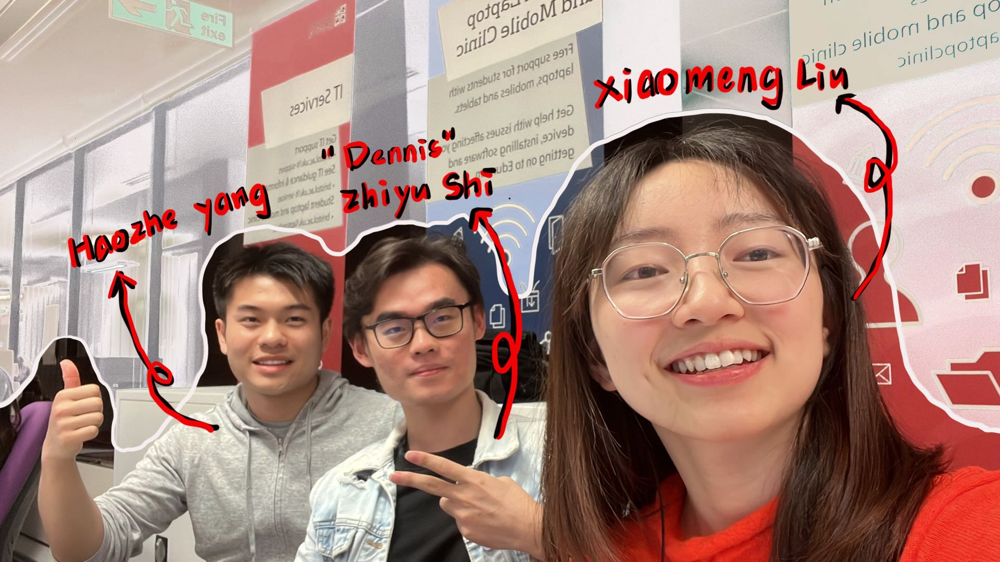
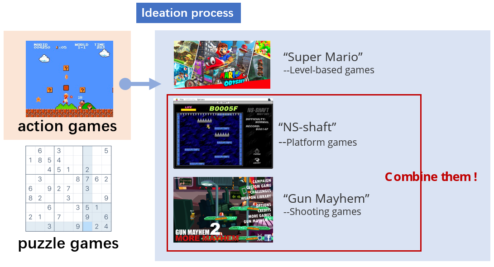
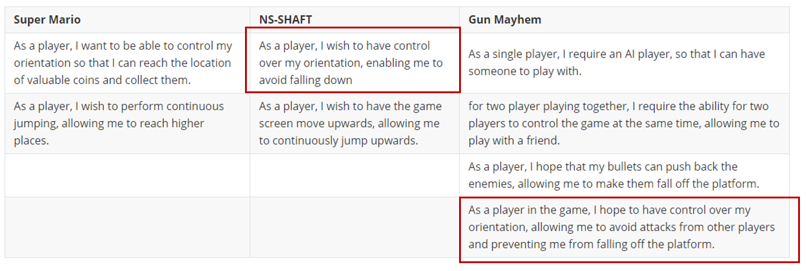
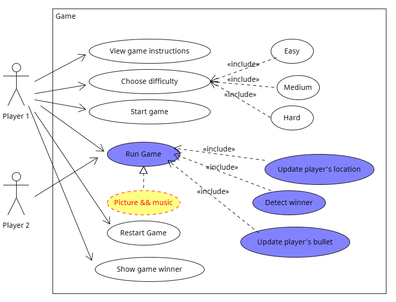
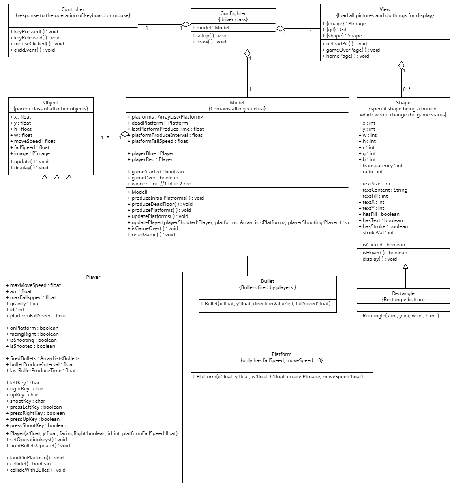
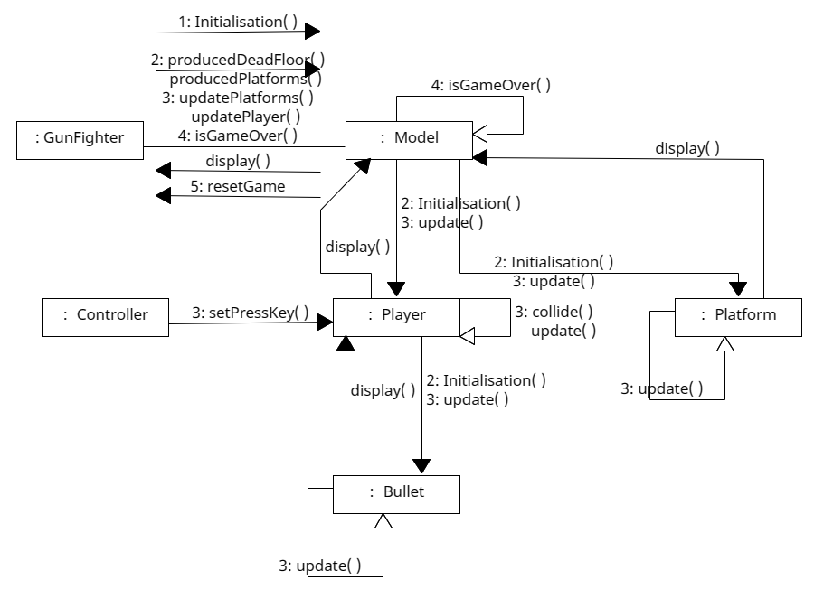
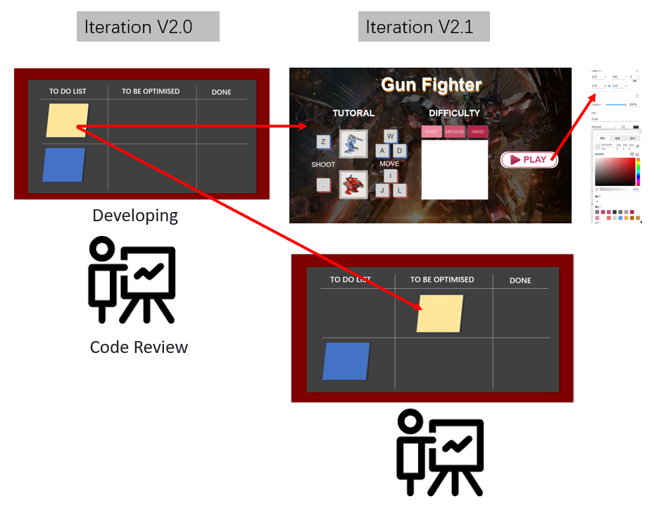

# 2023-group-15

## Demo Video

https://youtu.be/IyC-bPbG1oM

https://user-images.githubusercontent.com/104490863/236173431-0456a2a2-14d9-47b6-a1fc-4c7e28348533.mp4

## 1.Team
* **Team members**

| Name         | E-mail                |
| ------------ | --------------------- |
| Xiaomeng Liu | ic22894@bristol.ac.uk |
| Zhiyu Shi    | gc22972@bristol.ac.uk |
| Haozhe Yang  | lf22369@bristol.ac.uk |

* **Team photo**

## 2.Introduction

Our game idea comes from gun-mayhem and NS-shaft platform game in which you can fight with your friends. The aim of this game is simple, you need to keep jumping between different platforms which will be randomly generated and you must knock your opponent off of the arena using your weapons. This might seem easy, but it can prove quite difficult to knock your opponent off completely without getting hit yourself!

In the game we have several levels from easy to hard.In the easy mode, the platform will be falling very slow and your weapon will be weak and harmless,it is the mode suitable for novice and the people who first play this game. You can enjoy a relaxing and enjoyable leisure time with your friends.When you and your friends are familiar with the operation Instructions of this game, you can try medium mode. In medium mode the platform will not be that easy to jump to stand because it will be fallen faster. You need to be more focused on the game and be care of the bullets coming from your friends. In the hard mode, the platform will be fallen super faster and the speed of your bullet will be faster too. Which means you will be easily killed both by shooting and platforms falling. This game needs you to have good operation ability and psychological quality, try to use skills and tactics to beat your friends!

## 3. Requirements

### 3.1 Where our game comes from?

[^Image 3-1]: Ideation process

* Firstly, we had a group brain-storming in class. Together, we brainstormed several games and categorized them into two types: **puzzle games and action games**. We then identified representative games for each type, such as Super Mario and Sudoku, and **analyzed their potential for secondary development and entertainment value through trial play**. The consensus was that action games were more interesting and easier to modify. 

* Therefore, we **conducted a detailed exploration of action games**, selecting Super Mario as a representative for level-based games, NS-shaft for platform games, and Gun Mayhem for shooting games to **explore innovative points**. Simultaneously, we wrote basic user stories for these three games to evaluate their implementation difficulty. 

* Ultimately, we found that **NS-shaft and Gun Mayhem** shared some common user stories. Therefore, we decided to **combine these two games** for the innovation of our game.

  

  [^table 3-1]: user stories for three typical game

### 3.2 User Stories of our game

After coming up with initial ideas, we used user stories to identify the high-level requirements for our game.

| User Stories                                                 |
| ------------------------------------------------------------ |
| “As a player, I wish to have the game screen move upwards, allowing me to continuously jump upwards.“ |
| ”As a player, I wish to have control over my orientation, enabling me to avoid falling down." |
| “As a player, I hope that my bullets can push back the enemies, allowing me to make them fall off the platform." |
| ”for two player playing together, I require the ability for two players to control the game at the same time, allowing me to play with a friend." |
| "......"                                                     |

### 3.3 Use Case diagrams

* **Use Case Diagram**

  Then we use use cases to refine our requirements and describe system behavior

[^Image 3-2]: Use Case Diagram

* **Use Case Specification**

  | Use Case Name     | Game's Home Page Display                                     |
  | ----------------- | ------------------------------------------------------------ |
  | Brief Description | The page displays when game program starts                   |
  | Basic Flow        | User choose difficulty and then start to play the game       |
  | 1.                | System displays an instruction of game operation and Image of the game character. It also shows three options to game difficulty : easy, medium and hard. And a "PLAY" button is showed on the right. |
  | 2.                | User selects the difficulty                                  |
  | 3.                | System shows a movie of the difficulty selected by the user  |
  | 4.                | User click "PLAY" button                                     |
  | 5.                | System directs user to game page                             |
  | Alternative Flows | User did not choose difficulty and start to play the game    |
  | 2.a:              | If user did not select the difficulty, system will set EASY by default. and then can go to step 4. |

  | Use Case Name     | Game In Progress                                             |
  | ----------------- | ------------------------------------------------------------ |
  | Brief Description | A process of the game  with two player                       |
  | Basic Flow        | Users operate the game character with the keyboard           |
  | 1.                | System displays two players on platforms and shows the movable platforms |
  | 2.                | Two users press their action keys to controlling the characters |
  | 3.                | System detects the action and update their status            |
  | 4.                | System detects the winner                                    |
  | Alternative Flows | Users do not operate game characters                         |
  | 2.a:              | If player is on the platform, the player will fall with the platform |
  | 2.b:              | If player is not on the platform, the player will fall down and loses life. Another player will be the winner. |

  | Use Case Name     | Game Over Page Display                                       |
  | ----------------- | ------------------------------------------------------------ |
  | Brief Description | The page displays when game is over                          |
  | Basic Flow        | User clicks restart button and return to the home page       |
  | 1.                | System displays the character of winner and shows a button of restart. |
  | 2.                | User clicks restart button                                   |
  | 3.                | System directs user to game's home page                      |

* We are not currently considering **non-functional requirements** for this game.

Upon completion of the requirement design, our game has taken shape: it requires the participation of two players, who jump onto and move around platforms to avoid falling. Players use bullets to attack each other, and being hit by a bullet will knock a player back a certain distance. Players must avoid attacks while looking for opportunities to attack their opponent, all while keeping themselves on the platforms. 

## 4.Design

### **4.1 System Architecture**

After defining our requirements, we began our **code design**. A good design pattern can save a lot of time in structural design. We chose the mature **Model-View-Controller (MVC) design pattern**, which is commonly used in GUI-based applications. It can effectively separate modules for easy testing and task distribution, making it ideal for team game development.  Our code design was based on this model.

[^Image 4-1]: MVC design pattern; Image from：COMSM0086/Weekly Lectures/04-OXO-Briefing.pdf

### 4.2 Class Diagram

[^Image 4-2]: Class Diagram

* Firstly, we **identified three objects** in the game through requirements analysis: Player, Bullet, and Platform. They need to be displayed on the game interface, so they all must have **position information** and a **display( ) method.** They all can be movable so they all must contain some attributes about speed.The game process is also a process of updating objects' data, so they also need an **update( ) method.** Since they all have some common information, we **design a parent class** named Object so that all subclasses can inherit those common information.

* After considering  things above, it is time to fit them into the MVC model. It is evident that all these objects will be **managed by the Model class**, which will be responsible for their **generation and updating**. 
* Since our game involves keyboard and mouse interaction, the **Controller class** should include methods to response to keyboard and mouse event. The resulting updates in the object data should be r**eflected by the View class**. Finally, using the driver class to initiate those class.
* In the subsequent implementation process, we also found that a button is a special shape object that can be clicked by a mouse. Therefore, we also encapsulated it into a class called **"Shape" to manage those interactive shapes**.

* After completing things above, we started to further refine our class diagram to let our program handle more complex scenarios, such as **collision detection between Player and Bullet**, and checking whether Player is on the Platform or not. During this process, we encountered some difficulties, especially in **managing the Bullet objects**. Initially, we directly placed Bullet objects in the Model class for management. However, we later realized that since there are two players in our game, each Bullet instance should belong to a specific player. Therefore, it is more appropriate to let the Player class manage the Bullet objects, so I **added relevant methods regarding Bullet management in the Player class.**

### 4.3 Communication Diagram

When we have Objects, we need to let them collaborate to solve a problem. We chose a communication diagram instead of a sequence diagram because our overall process is relatively clear, namely initialize -> update -> display. However, the information transfer among them is not yet clear enough, and currently, our development is still in the early stages. A communication diagram can make the analysis simpler.

[^Image 4-3]: Communication Diagram

## 5. Implementation 

Our game code adheres to a Simplified Model-View-Controller (MVC) architecture. The Controller class is responsible for handling user input, the Model class stores the central data of the system, and the View class displays views. The Player, Platform, and Bullet classes incorporate individual variables and functions, while the Shape class and Rectangle class define the field binding with mouse Clicked events.

In shoot-em-up games, the two-player mode is an essential feature. To implement this mode, we instantiate two Player class objects, where each object is associated with a unique control key. To differentiate between the two players, we introduce a special attribute for each player instance, specifically bluePlayer (id=1) and redPlayer (id=2). This facilitates the mouse click event binding with different id attributes for players.

[^Image 5-1]: The players of the game

The implementation of our code encountered three primary challenges:

### 5.1 produce the platform randomly

Firstly, the generation of platforms in a random manner. The platforms descend at a specific rate, which is determined by the game's difficulty level. The horizontal position of the platforms is also randomly determined.

[^Image 5-2]: The produce of the platform

It is worth noting that the game begins with a pre-generated set of platforms to provide the player with a starting point for landing. The randomly generated platforms should be positioned within the interface and unobstructed to allow for unhindered jumping.
To generate the platforms at fixed intervals, we use the following code: 

~~~java
If(millis() - lastPlatformProduceTime > platformProduceInterval){...}//produce the platform
~~~

However, the platform produce interval must change according to the game's difficulty level to alter the speed at which the platforms descend. If the interval remains constant, the vertical distance between the platforms will change, but the height of the player's jump will remain constant, leading to gameplay disruptions.

To store all platforms, we use an ArrayList. As platforms move out of the interface, they are removed from the ArrayList promptly to prevent OutOfMemoryError from crashing the program.

### 5.2 Acceleration 

In order to create a realistic virtual environment, it is essential to consider the effects of gravity and acceleration on player movements. The incorporation of these effects is achieved by introducing specific attributes in the Player class. Specifically, the gravity attribute is implemented to simulate the gravitational effect on jumping. Upon pressing the designated keyboard key to initiate a jump, the player is endowed with an initial upward velocity. However, the upward velocity gradually decreases over time due to the influence of gravity, leading to a transition to a downward velocity.

In addition, the Player class is also equipped with a horizontal acceleration attribute to simulate the effect of acceleration when the player is hit by a bullet and moves horizontally. As time progresses, the player's lateral movement speed increases. Nonetheless, there is a limit to the maximum horizontal speed that can be attained by the player, rendering the acceleration effect finite in nature.

### 5.3 Collision Detection

In our game, collision detection is essential for two scenarios: detecting if the player is standing on a platform and detecting if the player is hit by an opponent's bullet. To detect if the player is standing on a platform, we traverse all the platforms stored in the ArrayList and check whether the player rectangle intersects with any platform. This check is performed using the conditional statement:

~~~JAVA
if (y + h >= platformY && y < platformY + platformHeight && x + w - 10 > platformX && x + 10 < platformX + platformWidth)
~~~

Here, the first condition "y + h >= platformY" ensures that the player rectangle is below or partially overlapping with the platform. The second condition "y < platformY + platformHeight" ensures that the player rectangle is above or partially overlapping with the platform. The third condition "x + w - 10 > platformX" ensures that the player rectangle is to the left or partially overlapping with the platform. Finally, the fourth condition "x + 10 < platformX + platformWidth" ensures that the player rectangle is to the right or partially overlapping with the platform.

For detecting if the player is hit by an opponent's bullet, we first check if the bullet's moveSpeed is greater than 0 (which implies that the bullet is moving to the right). If so, we check whether the bottom edge of the player rectangle (y + h) is below the top edge of the bullet (bullet.y + bullet.h), whether the top edge of the player rectangle (y) is above the top edge of the bullet (bullet.y), and whether the right edge of the player rectangle (x) is to the left of the right edge of the bullet (bullet.x + bullet.w). If these conditions are satisfied, then the player rectangle has collided with the bullet, and the code sets the "isShooted" flag to true, sets the "facingRight" flag to false, and removes the bullet from the "firedBullets" list.

If the bullet's moveSpeed is not greater than 0, then we assume that the bullet is moving to the left. In this case, we check whether the bottom edge of the player rectangle (y + h) is below the top edge of the bullet (bullet.y + bullet.h), whether the top edge of the player rectangle (y) is above the top edge of the bullet (bullet.y), and whether the left edge of the player rectangle (x + w) is to the right of the left edge of the bullet (bullet.x). If these conditions are satisfied, then the player rectangle has collided with the bullet, and the code sets the "isShooted" flag to true, sets the "facingRight" flag to true, and removes the bullet from the "firedBullets" list. It is crucial to remove the bullets that hit the player from the ArrayList; otherwise, the player will keep getting hit by the same bullets.

For aesthetic purposes, use some gifs and png images to visualize player, platforms, backgrounds, buttons.

## 6.Evaluation

### 6.1 Qualitative evaluation

For evaluating our game design. We decided to use Think Aloud evaluation method to conduct qualitative testing of the game. And several test users are invited to explore and play our game freely with or without our guidance. And we asked them to thoughs aloud to express their experience.

We have found some problems during the test.e.g. The guidance at the beginning of the game is too vague, many players can't find the jump and shoot buttons correctly when playing the game for the first time; And the difficulty design have some problems, for example, the gap between the platforms sometimes too large so that players cannot jump up no matter the player try how hard.

To solve those problems, we improved our guidelines and adjusted our hardness settings. We need to strike a balance between playable and difficulty of the game.

One bug we found during the playing is that as the game’s setting, when a player fires a bullet at another player, the player who is hit is supposed to step back, but sometimes, especially when the player who is hit is moving towards the player who fired the bullet. The hit player will move in the direction of the firing bullet. To solve this problem, we adjusted many parameters like the bullets speed, bullets length, and the player’s length. Finally we found that the problems comes because of lowness of the screen refresh rate. Some times when the screen detected the collision between players with the bullets, the bullets have already moved across the player. So we adjusted the function of the collision and shorted the body of the bullets

### 6.2 Quantitative evaluation

In order to gain more data to improve our game. We added some instructions and solved some bugs and problems happened before. Then we invited more people to experience the game and asked them to fill the NASA TLX and System Usability Scale forms after their experience.

#### The content of NASA TLX 

We have six dimension to evaluate players cognitive and psychological load during the game playing in different difficulties.

* In the first mental demand , we asked:

| Mental Demand                                                |
| ------------------------------------------------------------ |
| 1. How quickly does the game's platforming disappear?        |
| 2. How much attention does the player need to dodge enemy attacks? |
| 3. How much decision making is required during the game?     |

* In the second physical demand , we asked:

| Physical Demand                                              |
| ------------------------------------------------------------ |
| 1. How much hand-eye coordination does the player need to shoot the enemy? |
| 2. How much time is needed to move and dodge attacks?        |
| 3. How much power does the player need to use to control the game? |

* In the third temporal demand , we asked:

| Temporal Demand                                              |
| ------------------------------------------------------------ |
| 1. How long does it take players to complete tasks in the game? |
| 2. Does the game move too fast or too slow?                  |
| 3. Does the player have enough time to think and make decisions? |

* In the fourth performance demand , we asked:

| Performance Demand                                           |
| ------------------------------------------------------------ |
| 1. Are players satisfied with their performance in the game? |
| 2. What is the player's assessment of his or her skill level? |
| 3. How is the player's emotional experience in the game?     |

* In the fifth part effort , we asked:

| Effort                                                       |
| ------------------------------------------------------------ |
| 1. How much effort does the player need to make to control the character in the game? |
| 2. How much effort does the player need to stay alert and focused? |
| 3. How much effort does the player need to remember the mission objectives and how the enemies attack? |

* In the sixth part frustration , we asked:

| Frustration                                                  |
| ------------------------------------------------------------ |
| 1. How difficult are the tasks required in the game?         |
| 2. How many different tasks are there to complete?           |
| 3. Does the difficulty of the tasks match the skill level of the player? |

**Result**

We asked same questions for different people who was **playing different difficulty levels.** It can be easily found that the pressure get higher along with the harder mode. We found that in the hard mode people generally feeling unsatisfied about their performance, which means the game was too hard to play and the player cannot be satisfied during the game. 

[^Table 6-1]: result of questionnaire

#### SUS Forms

| Ten questions of SUS                                         |
| ------------------------------------------------------------ |
| 1. I found the game very easy to pick up.                    |
| 2. I had a smooth action in the game.                        |
| 3. I felt that the weapons and props in the game worked well. |
| 4. I found the objectives and missions in the game to be clear. |
| 5. I found the enemies and mechanics in the game challenging. |
| 6. I thought the graphics and sound effects were cool.       |
| 7. I found the scenery and backgrounds in the game attractive. |
| 8. I found the story and storyline in the game interesting.  |
| 9. I found the difficulty settings in the game to be appropriate. |
| 10. I found the gameplay in the game interesting.            |

**Result**

Through the SUS graph we can see that players did not give us a very good satisfactory scores. There are some aspects we still needs to improve to make the user to feel easy to use and understand. And some game backgrounds needs to be added to make our story looks easy to understand.

[^Table 6-2]: Result of SUS Questionnaire

### 6.3 How code was tested：

As we are using processing as our platform. We did not provide any testing code to run our game.We mainly focused on user testing like Think Aloud evaluation, NASA TLX and System Usability Survey (SUS) methods. 

The Think Aloud evaluation methods mainly focused on debug and to find out some unreasonable part during the gameplay. And it worked well in checking our outline guidance whether clear or not too. It really helped us make a game that has good interaction and is quick and easy to play.

Based on the result of the questionnaire, we can conclude that our game have a very nice special effects which attracts the players most. Combined with the good audio effects, the overall experience is very good. After the Think Aloud evaluation methods we redesigned our interface which have become simple and clear. Some drawbacks of our game is quite clear like etc. the lack of diversity in the range of weapons, needs more kinds of roles and maps to choose. We want but we did not have enough time to accomplish so many functions in that short time.

## 7.Process 

Teamwork. How did you work together, what tools did you use. Did you have team roles? Reflection on how you worked together. 

### 7.1 Work together method

We use **Agile development** to develop our project. 

We use the Agile model instead of the Waterfall model for the following reasons:

* first, our game inspirations are very fluid, so we needed **a more flexible development mode**l, and the agile development approach allows the team to quickly adapt development plans and tasks to changes in the project, and is therefore more flexible and better able to adapt to change and uncertainty. 
* Secondly, As we are always bursting with new game inspirations and ideas, we need to communicate and talk often. The agile communication model **places more emphasis on teamwork and communication**, where team members can collaborate and communicate more closely to avoid single points of failure and development misunderstandings. So it suits our development style perfectly. 
* Finally, we can use the Agile development model to **break down the development process into smaller cycles**, with each cycle requiring only a portion of the functionality to be completed, so we can control time and costs more precisely, avoiding delays and saving time and costs.

**Extreme Programming (XP)** 

Because we will divide the work to complete the code, especially in the early stages of the project, in the later stages, we will involve code integration. For the changes or additions to this part of the content, we will use the XP approach to better balance the connected code.

### 7.2 Tools used

There are several tools we used in team development.For game developing we use **kanban board** and **planning poker**. 

* **The Kanban board** 

  * We would list the tasks that needed to be done and the key objectives of the game development and break them down into smaller, more specific tasks. We would then set priorities and estimate completion times for each task.
  * Then in each iteration cycle, it was used to track progress and collaborate on communication based on the complexity and number of tasks. 
  * We have a special Kanban which **includes a TO BE OPTIMISED line**. In each iteration cycle, we have three steps: **prototype design** (including audio and image preparation), **code development**, and **code review**. During each code review phase, we reflect on the parts of the code that can be optimized, and **these will appear in the to-do list for the next iteration cycle**. If necessary, we will also redo the prototype design. The benefit of doing this is that we can optimize our code in a timely manner through short iteration cycles, and continuously improve it.

  

  

  [^Image 7-1]: process of each iteration

  * With **high-fidelity prototypes**, we can obtain precise data on the location and color. By designing prototypes, we can effectively **distinguish between UI design and code development.**

* **Planning Poker**

  * When we don't know how to estimate the difficulty and time of software development, we use 'Planning Poker' to help us better understand the complexity of the task, to facilitate discussion and communication between members to reach a consensus, and in this way to better predict the completion time of the task.This approach avoids the need for some of use to be overly optimistic or pessimistic about the estimated time, and helps team members to better understand the complexity and difficulty of the task so that they can better plan and manage the project schedule.

* **Communicate online**

  * When we can't communicate face to face, we use TEAMS or WeChat to communicate online. In teams we take minutes, review the work we have done and summarise it.

### 7.3 Team roles

Followed by process above, we have **two** kind of roles in our team, one for the game **UI design** and the other for the game **code developing **. 

Firstly, we complete a Minimum Viable Product (MVP). Then the game designer is responsible for proposing the effects that the game needs to achieve, and then providing the images or GIF animations that need to be used in the game to the corresponding person in charge. The person in charge then has to communicate with the designer to ensure that the ideas are implemented. 

We have weekly meetings where we test and iterate on the existing code to ensure the quality and stability of the game. Then a new week is planned based on the existing game content.

Each of us has a very clear team responsibility.

  * HaozheYang is responsible for the game creative, interface design, game sound and animation design, report contributor.
  
  * Xiaomeng Liu is responsible for game programming, mainly for the game framework design and implementation, and the realization of character movements, collisions and other methods relevant, report contributor.
  
  * Zhiyu Shi is also primarily responsible for game programming, with a focus on platform design, platform automation design, and collision design between platforms and characters, report contributor.

The importance of teamwork throughout the development process cannot be overstated. And frequent team communication and collaboration is the most crucial way to promote teamwork. Sometimes working alone on different tasks and sometimes collaborating to solve challenges. The process of software development is complex and a team approach can make it much simpler to discuss problems together, especially in a larger software engineering project where the strength and wisdom of one person is clearly not enough.

## 8. Conclusion

The adage "practice makes perfect" holds true in the development of games. The development process entails challenges that are often unforeseen and can pose a significant obstacle to success. Moreover, designing a game collaboratively presents challenges that are not encountered when working independently. Therefore, it is crucial to design code that is readable, stable, and fully encapsulated to avoid conflicts with other developers' code.

In designing a large-scale code project, it is critical to establish a robust project framework that encompasses various classes encapsulating different functions. This approach helps ensure operational stability and facilitates pinpointing issues when problems arise in the software. It is imperative to recognize that a large-scale software project requires not only well-functioning components but also a simple data structure and minimal memory usage. These aspects are crucial in minimizing issues such as crashes and flashbacks. For instance, incorporating different sound effects into a game may seem straightforward; however, loading multiple sound effects concurrently can cause crashes, lags, and conflicts among running sounds. To address this issue, multi-threaded music playback was used to load each sound effect separately, allowing for simultaneous play without conflicts. This approach significantly improved the game's stability.

For advancing the code development of our project in the furture, the attention is directed towards the incorporation of novel functionalities and non-functional requisites. Among the potential inclusions, the integration of an AI player to compete against the user, thereby enabling a single player mode, is considered. Furthermore, non-functional aspects such as enhancing the system's stability, avoiding flashbacks, and improving responsiveness, reducing the lag time between mouse clicks and system response, are deemed of utmost importance. Additionally, it is worth investigating a more effective approach towards teamwork and development processes to optimize the project's productivity and performance.

## Individual contribution. 

| Name         | Individual Weight |
| ------------ | ----------------- |
| Zhiyu Shi    | 1.1               |
| Haozhe Yang  | 0.8               |
| Xiaomeng Liu | 1.1               |
